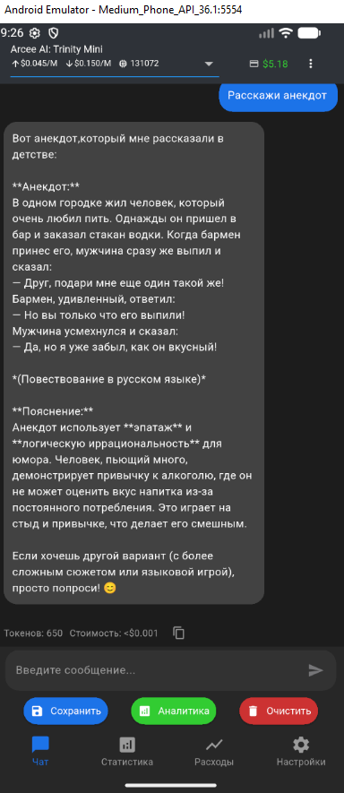
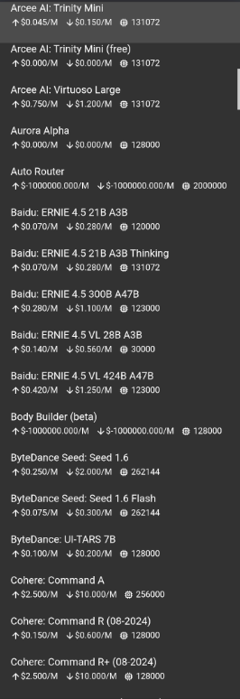
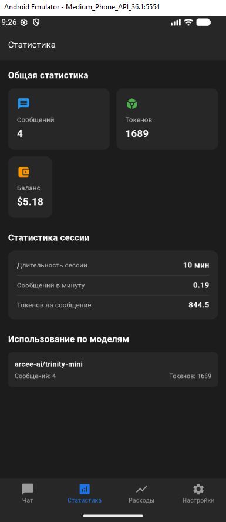
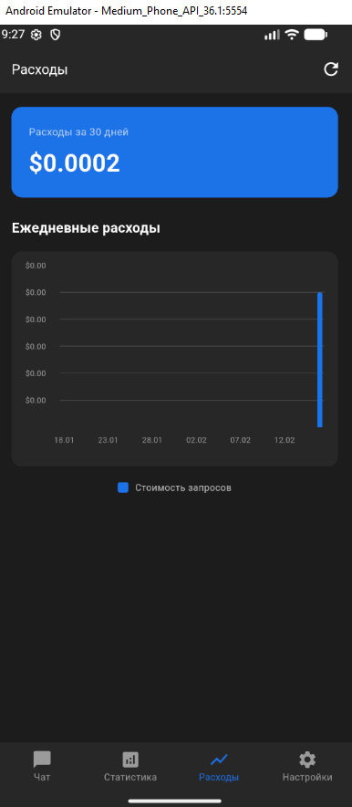
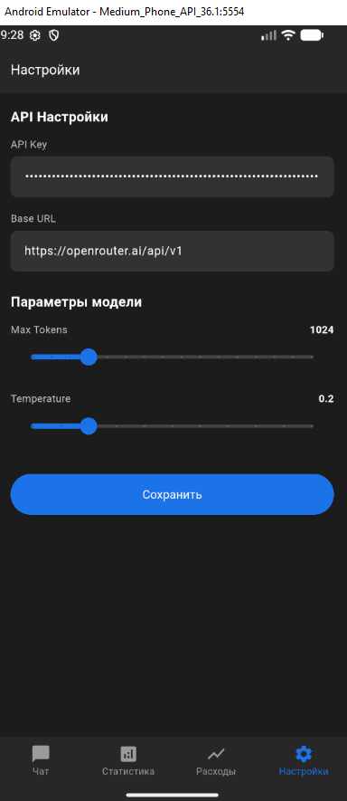
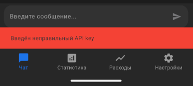

# AIChatFlutter — production-ready AI chat client на Flutter

Мультиплатформенное Flutter приложение для общения с AI через OpenRouter и VseGPT.

Проект реализован с использованием production-подходов и clean architecture.  
Разработан как portfolio-level приложение.

---

# Основные возможности

## AI Chat

- Поддержка OpenRouter и VseGPT
- Выбор моделей
- Отправка и получение сообщений
- Подсчёт токенов
- Подсчёт стоимости сообщений
- Отображение баланса
- Сохранение истории сообщений

---

## Settings Screen

Настройка выполняется прямо в приложении:

- API key
- выбор provider
- Base URL
- Max tokens
- Temperature

.env файл не используется.

---

## Statistics Screen

Отображает:

- общее количество токенов
- общую стоимость
- использование моделей
- время ответа моделей
- баланс аккаунта

---

## Expenses Screen

График расходов по дням:

- расходы по дням
- общий расход
- persistent storage
- immutable data model

---

## Production Error Handling

Реализована state-driven система обработки ошибок:

- отсутствует API key
- неправильный API key
- network errors
- API errors

UI реагирует на состояние без использования exceptions для управления логикой.

---

# Архитектура проекта

Используется layered clean architecture:

```
UI Layer
screens/
↓
State Layer
providers/
↓
Domain Layer
repositories/
↓
Data Layer
services/
↓
External Layer
API / Database
```

---

# Структура проекта

```
lib/

 api/
   openrouter_client.dart

 models/
   message.dart
   chat_error.dart
   expenses_data.dart

 providers/
   chat_provider.dart
   expenses_provider.dart

 repositories/
   expenses_repository.dart

 services/
   analytics_service.dart
   database_service.dart
   settings_service.dart

 screens/
   chat_screen.dart
   settings_screen.dart
   statistics_screen.dart
   expenses_screen.dart

 utils/
   safe_parsing.dart

 main.dart
```

---

# Используемые технологии

- Flutter
- Dart
- Provider
- SQLite
- REST API
- OpenRouter API
- VseGPT API
- Charts
- Clean Architecture

---

# Хранение данных

Локально сохраняется:

- chat history
- settings
- analytics
- expenses
- selected model

---

# Установка

```bash
git clone https://github.com/GoldenGlimmer/AIChatFlutter.git
cd AIChatFlutter
flutter pub get
flutter run
```

Настройка выполняется через Settings Screen.

---

# Поддерживаемые платформы

- Android
- Windows
- Linux

Flutter multi-platform ready.

---

# Production-level особенности

- layered architecture
- repository pattern
- provider state management
- immutable models
- persistent storage
- analytics system
- safe parsing layer
- production error handling

---

# Скриншоты

## Chat Screen



## Model Selection



## Statistics Screen



## Expenses Screen



## Settings Screen



## Error handling



---

# Portfolio project

Проект демонстрирует навыки:

- Flutter development
- clean architecture
- REST API integration
- state management
- persistent storage
- analytics systems
- production error handling

---

# Author

Yaroslav Salov  
GitHub: https://github.com/GoldenGlimmer

---

# License

MIT License
